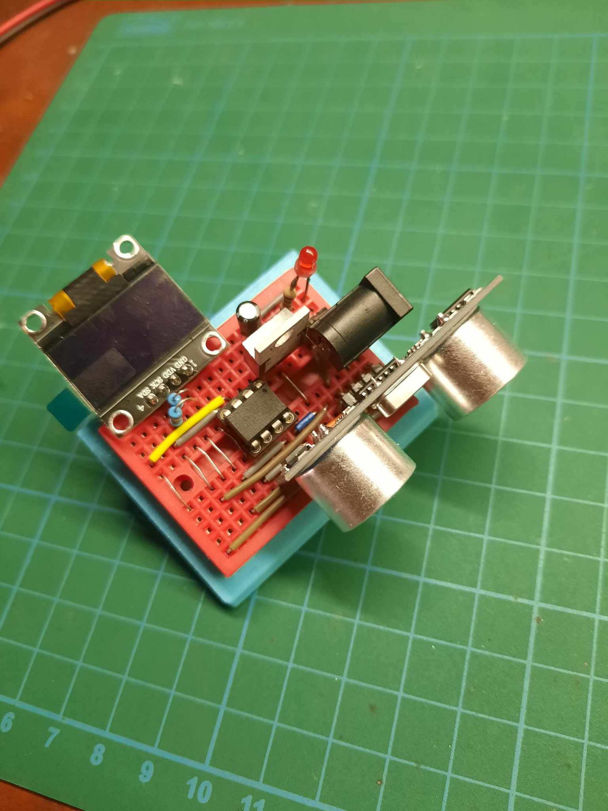

# Ultrasonic display

A display to show measurement from `HC-SR04` ultrasonic sensor
([the product page](https://www.sparkfun.com/products/15569)).

## Schematic

## Bill of Material

* ATTiny85
* HC-SR04 ([the datasheet](https://cdn.sparkfun.com/datasheets/Sensors/Proximity/HCSR04.pdf))
* SSD1306 OLED display (in any size, [the datasheet](https://cdn.sparkfun.com/assets/learn_tutorials/3/0/8/SSD1306.pdf))
* 10K pull-up resistor * 2
* A breadboard
* LM1117 (a 3.3V regulator, optional) with 10uF capacitor.

## Notes

ATTiny85 and SSD1306 run at 3.3V, while HC-SR04 at 5V. Use dual power supply
lanes on the breadboard, or use LM1117, or any 3.3V regulator with an output
capacitor.
